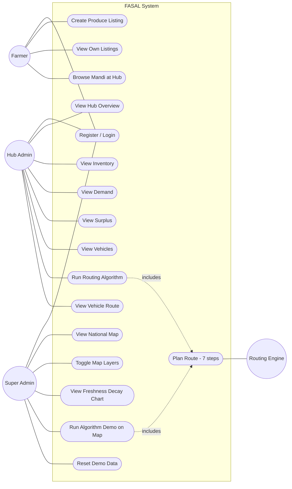

# Use Case Diagram — FASAL

## Actors

| Actor | Description |
|---|---|
| **Farmer** | Rural user with low tech literacy, on a mobile device. Registers via spoke and lists produce. |
| **Hub Admin** | Manages one of six city hubs. Sees inventory, demand, surplus; dispatches trucks. |
| **Super Admin** | National operator. Sees everything on a map; runs algorithm demos. |
| **System (Routing Engine)** | Internal actor — invoked by Hub Admin and Super Admin; performs the 7-step planning. |
| **Time / Scheduler** | Implicit actor — driving force behind freshness decay; the front-end polling interval. |

## High-Level Use Case Diagram

---

## Use Case Specifications

Each use case below follows a lightweight template: **Actor → Goal → Trigger → Main Flow → Alternate Flows → Postconditions**.

### UC1 — Register / Login

| Field | Value |
|---|---|
| Primary actor | Farmer / Hub Admin / Super Admin |
| Goal | Acquire a session token to access the system |
| Trigger | Visit any portal URL while not authenticated |
| Preconditions | Backend running; for login, a matching user row exists |
| Main flow (registration, farmer) | 1. Step through wizard (name → phone → password → spoke) ↦ 2. System POSTs `/api/auth/register` ↦ 3. `users` row + `sessions` row inserted ↦ 4. Token returned ↦ 5. Frontend stores token in `localStorage` and routes to dashboard |
| Main flow (login) | 1. User enters phone + password ↦ 2. POST `/api/auth/login` ↦ 3. Hash compared (SHA-256) ↦ 4. Session row inserted ↦ 5. Token returned and stored |
| Alternate (phone in use) | Registration returns 400 with `{"error":"Phone number is already registered."}` |
| Alternate (bad creds) | Login returns 400 with `{"error":"Invalid phone or password."}` |
| Postcondition | A valid `Authorization: Bearer <token>` header can be used for further requests |

### UC2 — Create Produce Listing

| Field | Value |
|---|---|
| Primary actor | Farmer |
| Goal | Tell the platform "I have N kg of produce harvested on date D" |
| Trigger | Mandi tab → "Add Listing" |
| Preconditions | Farmer is logged in |
| Main flow | 1. User picks produce type, quantity, harvest date ↦ 2. Frontend validates `qty > 0` and `harvest_date <= today` ↦ 3. POST `/api/farmer/listings` ↦ 4. Service derives the farmer's hub from their spoke ↦ 5. INSERT into `produce_listings` with status PENDING ↦ 6. Frontend reloads mandi |
| Alternate (future date) | Frontend shows toast "Harvest date cannot be in the future." — no request sent |
| Postcondition | New row in `produce_listings`; visible in own listings AND the hub's mandi view |

### UC3 — View Own Listings

| Field | Value |
|---|---|
| Primary actor | Farmer |
| Trigger | Open Home tab; auto-refreshes every 30 s |
| Main flow | GET `/api/farmer/listings` → backend computes `currentQuality` per row → frontend sorts ascending by Q (most at-risk first) → renders summary tiles + listing cards |

### UC4 — Browse Mandi at Hub

| Field | Value |
|---|---|
| Primary actor | Farmer |
| Trigger | Open Mandi tab |
| Main flow | Frontend re-uses `GET /api/farmer/listings` (in this build the "browse at hub" data and own listings are the same source); rendered with a "You" badge on the farmer's own cards |

### UC5–UC9 — Hub Admin Views

| UC | Endpoint | Description |
|---|---|---|
| UC5 Overview | `/api/hub/{id}/inventory`, `/demand`, `/vehicles`, `/routes` (parallel) | 4 stat cards: counts of items, demand, idle vehicles, routes today |
| UC6 Inventory | `/api/hub/{id}/inventory` (every 60 s) | Table sorted by Q ascending; colour-coded Q badges |
| UC7 Demand | `/api/hub/{id}/demand` | Table with min-quality threshold badges |
| UC8 Surplus | `/api/hub/{id}/surplus` | Inventory − demand per produce type, colour-coded |
| UC9 Vehicles | `/api/hub/{id}/vehicles` | Card per vehicle with IDLE/IN_TRANSIT badge |

### UC10 — Run Routing Algorithm

| Field | Value |
|---|---|
| Primary actor | Hub Admin |
| Goal | Plan a delivery and dispatch an IDLE truck |
| Trigger | Run Algorithm section → button click |
| Preconditions | Hub has at least one IDLE truck; routing engine reachable |
| Main flow | 1. Frontend fetches produce types (for λ) and all hubs (for haversine distance) [cached] ↦ 2. Fetches pre-run `/surplus` snapshot ↦ 3. POST `/api/routing/run` with `{hub_id}` ↦ 4. Engine runs 7 steps (see UC-INT) ↦ 5. Frontend animates 6 step cards with 400 ms stagger |
| Includes | UC-INT (Plan Route) |
| Alternate (no surplus) | RouteResult has `routeId=0` and `humanReadableSummary="This hub has no surplus produce to ship."` |
| Alternate (no idle truck) | RouteResult has `routeId=0` and reason "No idle vehicle is currently available at this hub." |
| Postcondition | New `routes` row (PLANNED), `route_stops` + `route_cargo` rows; truck flipped to IN_TRANSIT |

### UC11 — View Vehicle Route (inline)

| Field | Value |
|---|---|
| Primary actor | Hub Admin |
| Trigger | Vehicles section → click "View Route" on an IN_TRANSIT vehicle |
| Main flow | GET `/api/hub/{id}/routes` → find the non-completed route for this vehicle → render path (hub names joined by →), cargo list, and cold-storage indicator inline |

### UC12 — View National Map

| Field | Value |
|---|---|
| Primary actor | Super Admin |
| Trigger | Login succeeds |
| Main flow | 4 admin endpoints fetched in parallel: hubs, spokes, vehicles, routes → Leaflet layers built; map flies to India |

### UC13 — Toggle Map Layers

Each pill flips a flag in `toggleState` and either rebuilds the corresponding layer group or removes it from the map. "Clear All" clears every layer including the demo overlay.

### UC14 — View Freshness Decay Chart

Dropdown of produce types → on change, recomputes 3 series (normal, cold-storage 30%, threshold) and re-renders the Chart.js line chart.

### UC15 — Run Algorithm Demo on Map

| Field | Value |
|---|---|
| Primary actor | Super Admin |
| Goal | Visualise the routing algorithm running live |
| Trigger | "Run Algorithm" button OR clicking the in-popup button on a hub marker |
| Includes | UC-INT (Plan Route) |
| Main flow | 1. POST `/api/routing/run` for the selected hub ↦ 2. Map flies to source ↦ 3. Pulsing 🚛 marker placed at source ↦ 4. For each stop transition: draw polyline, animate truck along it (1.5 s, requestAnimationFrame), open popup at destination with cargo + arrival Q ↦ 5. After last stop, "🎉 Route Complete" popup at final hub ↦ 6. Routes layer is refreshed so the new route appears in the regular layer |

### UC16 — Reset Demo Data

POST `/api/seed/reset` truncates every data table (sessions wiped too) and re-inserts via `SeedRoutes.resetAndReseed()`. Useful when the demo state has accumulated too many routes/in-transit vehicles.

### UC-INT — Plan Route (Internal)

Encapsulates the 7-step `RoutingEngine.runRouting(hubId)` logic. See `08_SEQUENCE_DIAGRAMS.md` and the algorithm walk-through in `PROJECT_CONTEXT.md §7` for full detail.

---

## Use Case Relationships

| Relationship | Use Cases | Note |
|---|---|---|
| `includes` | UC10 → UC-INT, UC15 → UC-INT | The routing engine is invoked by both Hub Admin and Super Admin actions |
| `extends` | UC15 ← (popup "Run Algorithm Here") | A convenience entry point on the map popup extends UC15 |
| `generalisation` | UC1 ← Farmer-register, Farmer-login, Admin-login | Different concrete flows, same abstract use case |

---

## Coverage Matrix

| Functional Requirement (from SRS) | Use Case |
|---|---|
| FR-AUTH-01..08 | UC1 |
| FR-FARMER-01..14 | UC1, UC2, UC3, UC4 |
| FR-HUB-01..08 | UC1, UC5–UC9, UC10, UC11 |
| FR-ADMIN-01..09 | UC1, UC12, UC13, UC14, UC15 |
| FR-ALG-01..09 | UC-INT (covered by UC10 + UC15) |
| FR-MAINT-01 | UC16 |
