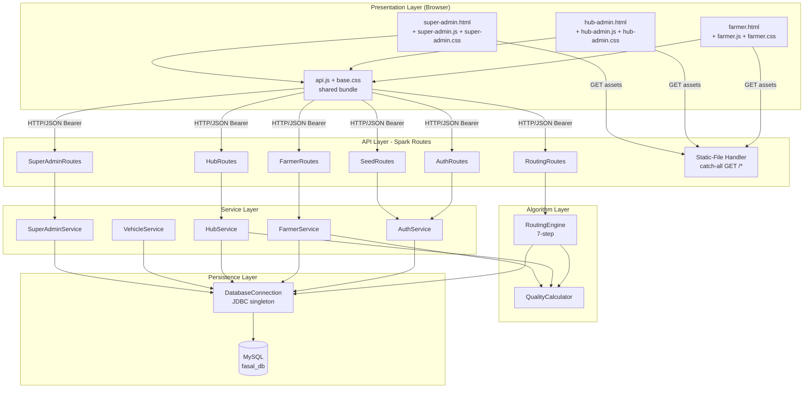
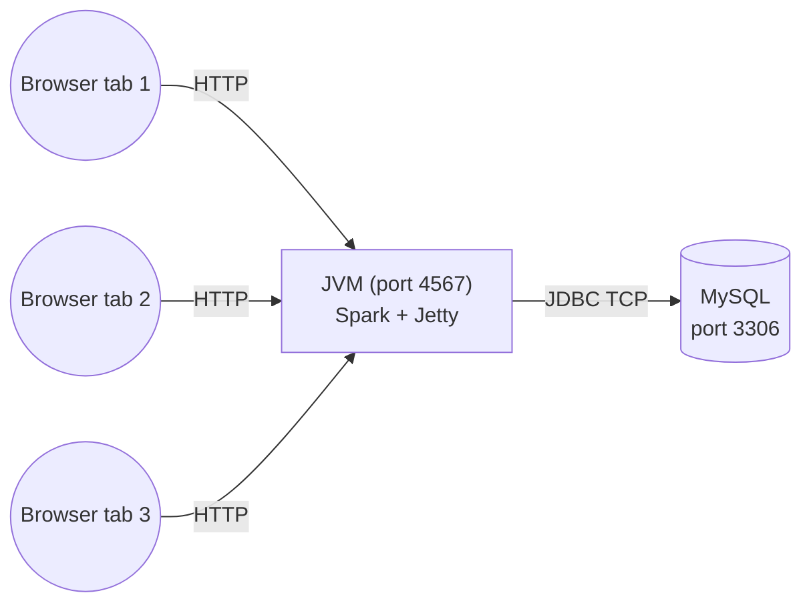

# Architecture Document — FASAL

## 1. Architectural Goals

| Goal | How it is achieved |
|---|---|
| **Run anywhere** | Pure Java + MySQL + plain HTML/CSS/JS; no Docker, no npm, no Python |
| **Beginner-readable code** | Plain-English comments on every class/method; no DI container; no Lombok |
| **End-to-end runnable in < 5 min** | `start.sh` / `start.bat` handles DB creation, seed, compile, run |
| **Same-origin frontend** | Spark backend also serves the `frontend-web/` folder |
| **Educational transparency** | The 7-step routing algorithm is visualised live in both Hub Admin and Super Admin UIs |

## 2. Architectural Style

FASAL is a **layered monolith** with a thin **REST API** on top:

* Presentation (HTML/CSS/JS — three SPAs)
* API (Spark route handlers)
* Service (data access, business orchestration)
* Algorithm (the routing engine)
* Persistence (MySQL via JDBC)

No queues, no caches, no microservices. The single JVM process serves both the API and the static frontend on the same port.

## 3. Logical View — Layered Architecture



## 4. Component Responsibilities

| Component | Role | File |
|---|---|---|
| **Main** | JVM entry; verifies DB; configures Spark; CORS filter; resolves frontend folder; registers static-file handler | `backend/.../Main.java` |
| **DatabaseConnection** | Static JDBC factory — single configuration point for `DB_URL`, `DB_USER`, `DB_PASSWORD` | `backend/.../db/DatabaseConnection.java` |
| **Models** | 12 POJOs mirroring DB tables + `RouteResult` for algorithm output | `backend/.../models/*.java` |
| **AuthService** | SHA-256 password hashing, UUID session tokens, login/register/validateToken | `backend/.../services/AuthService.java` |
| **FarmerService** | Farmer-scoped queries (listings, produce-types, spokes); computes live Q(t) | `backend/.../services/FarmerService.java` |
| **HubService** | Hub-scoped queries (inventory, demand, surplus, vehicles, routes); shared `loadRoutesByIds` helper | `backend/.../services/HubService.java` |
| **VehicleService** | Vehicle CRUD; status & current-hub mutators called by RoutingEngine | `backend/.../services/VehicleService.java` |
| **SuperAdminService** | Aggregate / system-wide queries; overview stats | `backend/.../services/SuperAdminService.java` |
| **QualityCalculator** | Q(t) = e^(-λt) helpers — current quality, projected at arrival, days-until-threshold | `backend/.../algorithm/QualityCalculator.java` |
| **RoutingEngine** | The 7-step routing logic + persistence in a single transaction | `backend/.../algorithm/RoutingEngine.java` |
| **AuthRoutes** | `POST /api/auth/{register,login}` | `backend/.../api/AuthRoutes.java` |
| **FarmerRoutes** | `POST /api/farmer/listings`, `GET /api/farmer/{listings,produce-types}`, `GET /api/spokes` | `backend/.../api/FarmerRoutes.java` |
| **HubRoutes** | `GET /api/hub/:hubId/{inventory,demand,surplus,vehicles,routes}` | `backend/.../api/HubRoutes.java` |
| **RoutingRoutes** | `POST /api/routing/run`, `GET /api/routing/routes` | `backend/.../api/RoutingRoutes.java` |
| **SuperAdminRoutes** | `GET /api/admin/{hubs,spokes,vehicles,routes,overview}` | `backend/.../api/SuperAdminRoutes.java` |
| **SeedRoutes** | `POST /api/seed/reset` — truncate-and-reseed | `backend/.../api/SeedRoutes.java` |
| **Static-File Handler** | `GET /*` catch-all that streams files from `frontend-web/` | inside `Main.java` |

## 5. Process View

The system runs in **one JVM process** plus one MySQL process.



Concurrency notes:

* Spark/Jetty uses a thread pool to handle requests in parallel.
* Service methods are **stateless** — every call opens its own JDBC connection via `try-with-resources`. There is no connection pool; for the demo this is sufficient.
* The routing engine is **stateless** between calls; each `runRouting()` invocation is independent.
* DB writes inside `RoutingEngine.persistRoute` are wrapped in a manual transaction (`setAutoCommit(false); ...; commit();`).

## 6. Physical / Deployment View (Local Dev)

(See `10_DEPLOYMENT_DIAGRAM.md` for diagrams.)

```
Developer laptop
├── JDK 11+, Maven 3.6+
├── MySQL 8.0+
└── (cloned) FASAL/
    ├── backend/         ← compiled & run via `mvn exec:java`
    └── frontend-web/    ← served by the same Spark process
```

## 7. Data View

* Database: `fasal_db` (MySQL).
* 13 tables; FKs and indexes documented in `04_ER_DIAGRAM.md`.
* Reference data (hubs, spokes, produce_types, hub_distances) is seeded once and rarely changes.
* Operational data (produce_listings, inventory, demand, routes, route_stops, route_cargo, sessions, vehicles) grows / mutates during use.

## 8. Security View

| Concern | Approach |
|---|---|
| Auth | SHA-256 hashed passwords; Bearer tokens (UUID-no-dashes); persisted in `sessions` |
| Transport | HTTP only (demo); production must terminate TLS at a reverse proxy |
| Authorization | Role enforcement is **frontend-side**; backend only verifies token presence + validity. Production must add role checks on `/api/admin/*` and `/api/routing/*`. |
| SQL injection | Mitigated by exclusive use of `PreparedStatement` |
| XSS | All HTML interpolation passes through `esc(...)` helper |
| Path traversal (static handler) | Guarded by `getCanonicalPath().startsWith(rootCanonical)` |
| CSRF | Not addressed — Bearer in `Authorization` header + token stored in `localStorage` makes this a non-issue for the SPA, but worth noting |
| CORS | Open (`*`) — fine for demo; tighten for production |

## 9. Cross-Cutting Concerns

| Concern | Implementation |
|---|---|
| Logging | `System.out.println` / `System.err.println` only — SLF4J Simple binds to console |
| Error handling | Route handlers wrap service calls in `try/catch (Exception)`; convert to JSON `{ "error": "..." }` + appropriate status |
| Validation | Performed in routes (e.g. `phone` required, body parsed by Gson) and in frontend pre-flight (regex for phone, length for password) |
| Internationalisation | Not implemented; UI is English with one Hindi welcome string |
| Time / Date | Java `LocalDate` server-side; ISO `yyyy-MM-dd` over the wire; lenient parsing in frontend `formatDate(...)` |

## 10. Technology Choice Rationale

| Choice | Why |
|---|---|
| **Spark Java over Spring Boot** | Tiny dependency footprint, near-zero ceremony, easy to read for a beginner |
| **Plain HTML/CSS/JS over React/Vue** | No build pipeline; one less thing to install/learn; the project is small enough that vanilla DOM stays manageable |
| **JDBC over Hibernate** | Schema is small and stable; every SQL statement is visible and beginner-readable |
| **Gson over Jackson** | Smaller dep, simpler API, plenty for this domain |
| **MySQL over Postgres** | Familiar to most Indian engineering tutorials; SHA2() built-in for the seed file |
| **Leaflet over Google Maps** | Free, no API key, ships from a CDN |
| **Chart.js over D3** | One-line line charts; far less code |

## 11. Known Architectural Decisions Recorded

| # | Decision | Rationale |
|---|---|---|
| 1 | Single port serves both API and frontend | Eliminates the `file://` Private Network Access issue without forcing users to install a static server |
| 2 | Backend serves frontend via explicit `get("/*")` route, not `staticFiles.externalLocation()` | The Spark built-in returned 400 Bad Request on Windows + Spark 2.9.4 + Jetty 9.4; the explicit handler works the same everywhere |
| 3 | Role enforcement on frontend only | Speeds up the demo; explicit limitation documented in SRS (FR-AUTH-08) |
| 4 | Tokens never expire (no refresh tokens) | Acceptable for demo; production would need expiry + refresh |
| 5 | `RoutingEngine` is stateless and creates a new instance per request | Simpler reasoning; no shared mutable state across threads |
| 6 | Surplus is computed on-the-fly, never stored | Always consistent with the underlying tables |
| 7 | `currentQuality` (Q(t)) is computed in Java, not SQL | Allows it to be "live" — reflects the moment of the read, not the moment of the database write |

## 12. Limitations & Known Trade-offs

* No connection pooling — every DB operation opens a fresh connection. Fine for demo throughput; would not survive heavy concurrent load.
* No write-ahead route undo — `RoutingEngine` writes to three tables in a single transaction, but there is no "cancel route" endpoint.
* Stateful UI bugs — a stale `localStorage` token can leave a user stranded on a half-broken dashboard. Tracked in `GITHUB_ISSUES.md` Issue #3.
* No clustering — a second JVM on the same DB would conflict on vehicle status updates.
* CDN-loaded libraries — the Super Admin console depends on internet access to load Leaflet and Chart.js. Vendoring is straightforward if offline-first is required.
