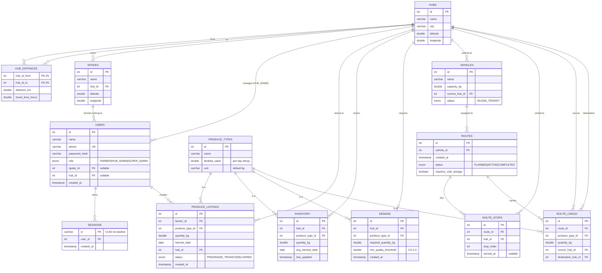

# Entity-Relationship Diagram — FASAL

## 1. Conceptual Overview

13 tables grouped by domain:

| Group | Tables | Purpose |
|---|---|---|
| Geography | `hubs`, `hub_distances`, `spokes` | The physical network |
| Identity | `users`, `sessions` | Who can sign in and how |
| Catalogue | `produce_types` | Master list of produce with λ |
| Operational data | `produce_listings`, `inventory`, `demand` | What was harvested, what's in stock, what's wanted |
| Fleet | `vehicles` | The trucks |
| Routing | `routes`, `route_stops`, `route_cargo` | Planned/active/completed deliveries |

## 2. Full ER Diagram (Mermaid)



## 3. Cardinality Reference

| From | To | Cardinality | Notes |
|---|---|---|---|
| `hubs` | `spokes` | 1 : N | Each spoke has exactly one parent hub |
| `hubs` | `hub_distances.hub_id_from` | 1 : N | Each hub is the *from* in N rows |
| `hubs` | `hub_distances.hub_id_to` | 1 : N | And the *to* in N rows |
| `spokes` | `users.spoke_id` | 1 : N (nullable) | Only farmers carry a spoke_id |
| `hubs` | `users.hub_id` | 1 : N (nullable) | Only HUB_ADMINs carry a hub_id |
| `users` | `sessions` | 1 : N | One row per active token |
| `users` | `produce_listings.farmer_id` | 1 : N | A farmer creates many listings |
| `produce_types` | `produce_listings` | 1 : N | A produce type is referenced by many listings |
| `produce_types` | `inventory` | 1 : N | Stock per type per hub |
| `produce_types` | `demand` | 1 : N | Demand per type per hub |
| `produce_types` | `route_cargo` | 1 : N | One produce type can be carried on many cargo rows |
| `hubs` | `inventory` | 1 : N | Stock per hub |
| `hubs` | `demand` | 1 : N | Demand per hub |
| `hubs` | `vehicles.current_hub_id` | 1 : N | Trucks currently parked at a hub |
| `vehicles` | `routes` | 1 : N | A vehicle may have many historical routes |
| `routes` | `route_stops` | 1 : N | Ordered by `stop_order` |
| `routes` | `route_cargo` | 1 : N | Multiple cargo items per route |
| `hubs` | `route_stops` | 1 : N | A hub is visited as part of many route_stops |
| `hubs` | `route_cargo.source_hub_id` | 1 : N | Cargo originates from a hub |
| `hubs` | `route_cargo.destination_hub_id` | 1 : N | Cargo terminates at a hub |

## 4. Keys & Indexes

### Primary Keys
* Surrogate `INT AUTO_INCREMENT` on every table except:
  * `sessions.id` (`VARCHAR(64)`) — the Bearer token itself.
  * `hub_distances` (composite `(hub_id_from, hub_id_to)`).

### Unique Constraints
* `users.phone` — login handle.

### Foreign Keys

All relationships above are enforced with `FOREIGN KEY ... REFERENCES ...`. Drop order in `schema.sql` is the reverse of the dependency graph:

```
route_cargo → route_stops → routes → vehicles → demand → inventory →
produce_listings → sessions → users → spokes → produce_types →
hub_distances → hubs
```

### Indexes

* `idx_spokes_hub` on `spokes(hub_id)`.
* `idx_users_phone` on `users(phone)`, `idx_users_role` on `users(role)`.
* `idx_sessions_user` on `sessions(user_id)`.
* `idx_listings_farmer`, `idx_listings_hub` on `produce_listings`.
* `idx_inventory_hub`, `idx_inventory_produce`.
* `idx_demand_hub`, `idx_demand_produce`.
* `idx_vehicles_hub` on `vehicles(current_hub_id)`.
* `idx_routes_vehicle`, `idx_routes_status` on `routes`.
* `idx_route_stops_route`, `idx_route_cargo_route`.

## 5. Notes & Constraints

* `users.spoke_id` and `users.hub_id` are both nullable; exactly one is non-null for FARMER and HUB_ADMIN, both null for SUPER_ADMIN. This is enforced by convention (seed/registration code), not by a DB CHECK constraint.
* `route_stops.stop_order` is intended to start at `1` for the source hub and increment from there. Not enforced by the DB.
* `route_cargo.source_hub_id` is always the route's source hub (the first `route_stops.hub_id`). Not enforced by the DB.
* `vehicles.status` and `vehicles.current_hub_id` are mutated only by `RoutingEngine.persistRoute()` (set to IN_TRANSIT + last stop's hub).
* `produce_listings.status` is set to `PENDING` on creation and otherwise never updated by the current code (a real production system would flip it to IN_TRANSIT when packed onto a route).

## 6. Derived / Computed Data (not in any column)

| Concept | How it's derived | Where |
|---|---|---|
| `currentQuality` (Q(t)) | `Math.exp(-λ · daysSinceHarvest)` | In Java on every read of `inventory` / `produce_listings` |
| `surplus_qty` | `inventory_qty − demand_qty` per produce type at a hub | `HubService.getSurplus()` |
| `projected_Q_at_arrival` | `Math.exp(-λ · (daysSinceHarvest + travelHours/24))` | `QualityCalculator.calculateQualityAtArrival` |
| `requires_cold_storage` | True if any cargo's projected_Q at arrival < its demand's `min_quality_threshold` | `RoutingEngine.evaluateColdStorage()` |
