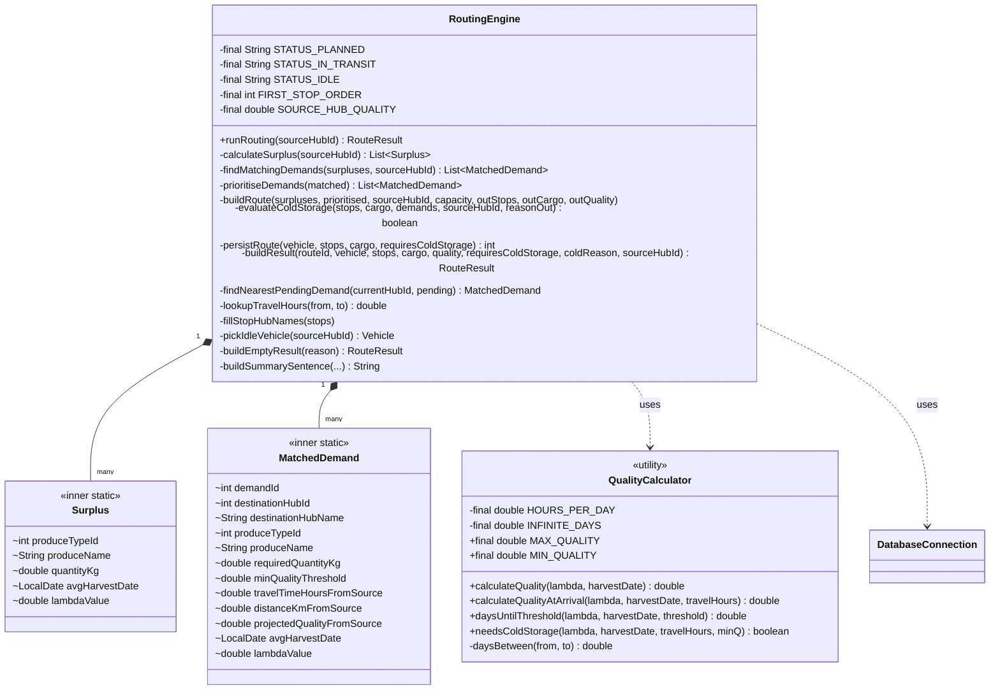
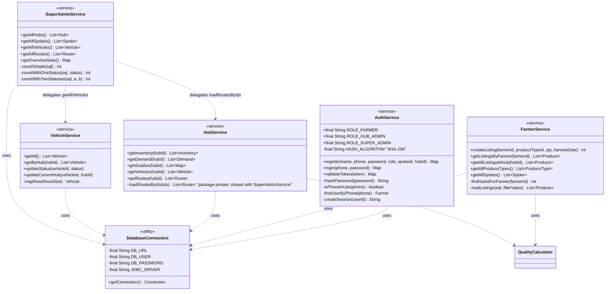
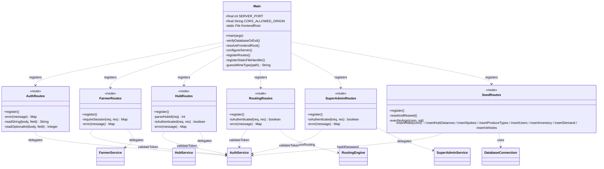
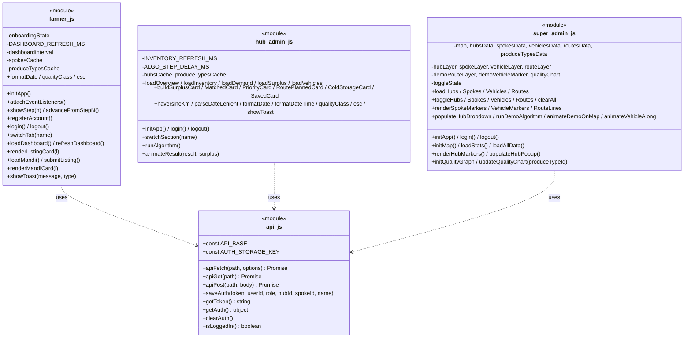

# Class Design Document — FASAL

## 1. Package Overview

```
com.fasal
├── Main                       (entry point)
├── db
│   └── DatabaseConnection     (JDBC singleton)
├── models                     (12 POJOs)
├── algorithm
│   ├── QualityCalculator
│   └── RoutingEngine          (uses inner classes Surplus, MatchedDemand)
├── services                   (5 static utility classes)
│   ├── AuthService
│   ├── FarmerService
│   ├── HubService
│   ├── VehicleService
│   └── SuperAdminService
└── api                        (6 route classes)
    ├── AuthRoutes
    ├── FarmerRoutes
    ├── HubRoutes
    ├── RoutingRoutes
    ├── SuperAdminRoutes
    └── SeedRoutes
```

All `services` and `api` classes follow the same pattern: a `final class` (effectively — no `final` keyword but no subclasses), a `private` constructor, and `public static` methods. This is intentional — no dependency-injection container, no service locator, just clear static calls.

---

## 2. Models — Class Diagram

```mermaid
classDiagram
    class Hub {
        -int id
        -String name
        -String city
        -double latitude
        -double longitude
        +getters/setters
    }
    class Spoke {
        -int id
        -String name
        -int hubId
        -double latitude
        -double longitude
    }
    class Farmer {
        -int id
        -String name
        -String phone
        -String passwordHash
        -String role
        -Integer spokeId
        -Integer hubId
        -Timestamp createdAt
        Note: represents any user row, not just farmers
    }
    class ProduceType {
        -int id
        -String name
        -double lambdaValue
        -String unit
    }
    class Produce {
        -int id
        -int farmerId
        -int produceTypeId
        -double quantityKg
        -LocalDate harvestDate
        -int hubId
        -String status
        -Timestamp createdAt
        -String produceName
        -double lambdaValue
        -double currentQuality
    }
    class Inventory {
        -int id
        -int hubId
        -int produceTypeId
        -double quantityKg
        -LocalDate avgHarvestDate
        -Timestamp lastUpdated
        -String produceName
        -double lambdaValue
        -double currentQuality
    }
    class Demand {
        -int id
        -int hubId
        -int produceTypeId
        -double requiredQuantityKg
        -double minQualityThreshold
        -Timestamp createdAt
        -String produceName
        -double lambdaValue
    }
    class Vehicle {
        -int id
        -String name
        -double capacityKg
        -int currentHubId
        -String status
    }
    class Route {
        -int id
        -int vehicleId
        -Timestamp createdAt
        -String status
        -boolean requiresColdStorage
        -String vehicleName
        -List~RouteStop~ stops
        -List~RouteCargo~ cargo
    }
    class RouteStop {
        -int id
        -int routeId
        -int hubId
        -int stopOrder
        -Timestamp arrivedAt
        -String hubName
    }
    class RouteCargo {
        -int id
        -int routeId
        -int produceTypeId
        -double quantityKg
        -int sourceHubId
        -int destinationHubId
        -String produceName
        -String sourceHubName
        -String destinationHubName
    }
    class RouteResult {
        -int routeId
        -String vehicleName
        -int vehicleId
        -List~RouteStop~ stops
        -List~RouteCargo~ cargo
        -boolean requiresColdStorage
        -Map~Integer,Double~ qualityAtEachStop
        -String humanReadableSummary
        -String coldStorageReason
    }

    Route "1" *-- "many" RouteStop
    Route "1" *-- "many" RouteCargo
    RouteResult "1" *-- "many" RouteStop
    RouteResult "1" *-- "many" RouteCargo
```



**Composition (♦):** `Route` owns its `stops` and `cargo` lists; serialised together in JSON output. `RouteResult` is the algorithm's output container — same composition relationship.

---

## 3. Algorithm Layer — Class Diagram



---

## 4. Services Layer — Class Diagram



---

## 5. API Layer — Class Diagram



---

## 6. Frontend "Classes" — Pseudo Module Map

Vanilla JS uses no actual classes, but `api.js` and the per-page scripts have a clear module shape:



---

## 7. Key Static Constants by File

A consolidated cheatsheet — useful when reviewing diffs or proposing changes.

| File | Constants |
|---|---|
| `Main.java` | `SERVER_PORT=4567`, `EXIT_CODE_DB_FAILURE=1`, CORS allowed origin/methods/headers |
| `DatabaseConnection.java` | `DB_URL`, `DB_USER`, `DB_PASSWORD`, `JDBC_DRIVER` |
| `AuthService.java` | `HASH_ALGORITHM="SHA-256"`, `ROLE_FARMER`, `ROLE_HUB_ADMIN`, `ROLE_SUPER_ADMIN` |
| `RoutingEngine.java` | `STATUS_PLANNED`, `STATUS_IN_TRANSIT`, `STATUS_IDLE`, `FIRST_STOP_ORDER=1`, `SOURCE_HUB_QUALITY=1.0`, `SELF_TRAVEL_HOURS=0.0` |
| `QualityCalculator.java` | `HOURS_PER_DAY=24.0`, `INFINITE_DAYS=+∞`, `MAX_QUALITY=1.0`, `MIN_QUALITY=0.0` |
| Route classes | `HTTP_UNAUTHORIZED=401`, `HTTP_BAD_REQUEST=400`, `HTTP_SERVER_ERROR=500`, `CONTENT_TYPE_JSON="application/json"`, `BEARER_PREFIX="Bearer "` |
| `SeedRoutes.java` | `DEFAULT_TRUCK_CAPACITY_KG=1000.0`, `VEHICLE_STATUS_IDLE="IDLE"` |
| `api.js` | `API_BASE="http://localhost:4567"`, `AUTH_STORAGE_KEY="fasal_auth"` |
| `super-admin.js` | `INDIA_CENTER=[20.5937,78.9629]`, `INDIA_ZOOM=5`, `CHART_MAX_DAYS=30`, `COLD_STORAGE_FACTOR=0.3`, `CHART_MIN_THRESHOLD=0.5`, `DEMO_STEP_PAUSE_MS=1500`, `DEMO_LEG_DURATION_MS=1500` |
| `farmer.js` | `DASHBOARD_REFRESH_MS=30000` |
| `hub-admin.js` | `INVENTORY_REFRESH_MS=60000`, `ALGO_STEP_DELAY_MS=400` |

---

## 8. Dependency Direction (Layer Rule)

```
api  ──► services  ──► algorithm  ──► db
                      └─► models  ◄── (every layer reads/writes models)
```

* `api` depends on `services` (and on `algorithm.RoutingEngine` for the routing endpoint).
* `services` depends on `db` and `algorithm.QualityCalculator`.
* `algorithm` depends on `db` and `models`.
* `models` is leaf — depends on nothing project-internal.

There are no upward dependencies. No cycles.
