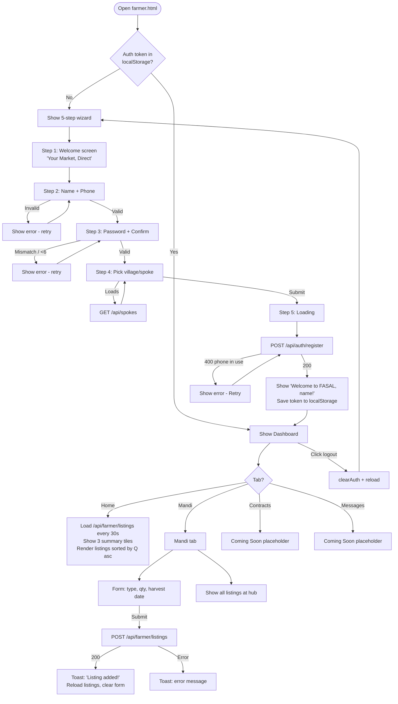
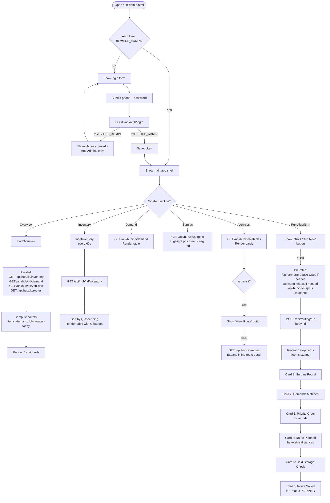
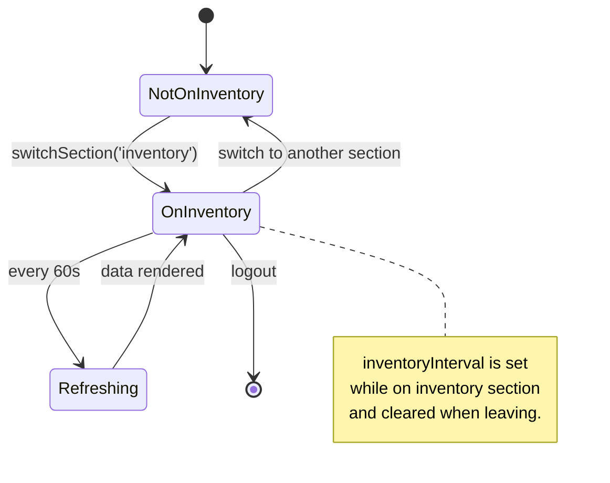
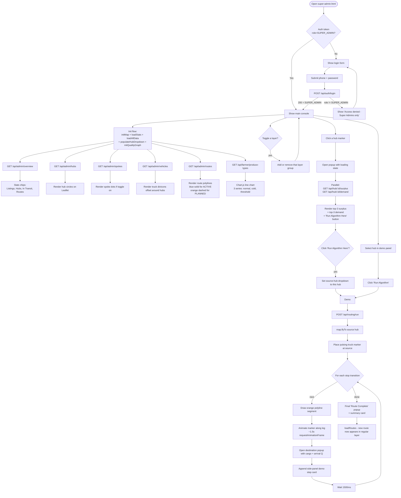
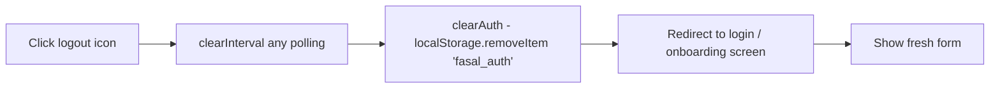
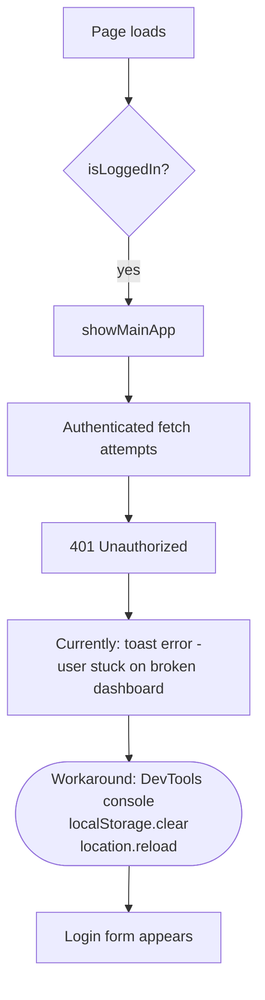

# User Flow Diagrams — FASAL

End-to-end journeys per persona. Each diagram is a Mermaid flowchart that renders natively on GitHub / VS Code / Obsidian.

---

## 1. Farmer — Full Journey

### Highlights

| Step | Validation | Endpoint |
|---|---|---|
| 2 | Name length ≥ 2, phone `/^\d{10}$/` | — |
| 3 | Password length ≥ 6, confirmation matches | — |
| 4 | One spoke must be selected | `GET /api/spokes` |
| 5 | — | `POST /api/auth/register` |

The Home tab uses `setInterval(refreshDashboard, 30000)`. The interval is cleared when the user switches away from the Home tab or logs out.

---

## 2. Hub Admin — Full Journey

### Inventory Auto-Refresh Lifecycle

---

## 3. Super Admin — Full Journey

### Toggle State

The frontend keeps a `toggleState = { hubs: true, spokes: false, vehicles: true, routes: true }` object. Clicking any pill flips the flag and rebuilds (or removes) just that layer group; the rest are untouched.

`Clear All` sets every flag to false and removes every layer including the demo overlay and demo vehicle marker.

---

## 4. Cross-cutting — Logout

There is no server-side logout endpoint — the session row in the DB stays until the next schema rebuild or `/api/seed/reset`. This is documented as a known limitation in `01_SRS_DOCUMENT.md` and `PROJECT_CONTEXT.md §22`.

---

## 5. Cross-cutting — Recovering from a Stale Token (Workaround)

If the user's token has been invalidated server-side (e.g. someone hit `/api/seed/reset` while they were logged in):

Proposed fix (queued in `GITHUB_ISSUES.md` Issue #3): treat any `401` in `apiFetch` as a signal to `clearAuth()`; each page's loader catches the thrown `401` and routes back to login automatically.
