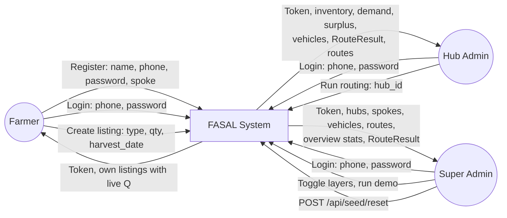
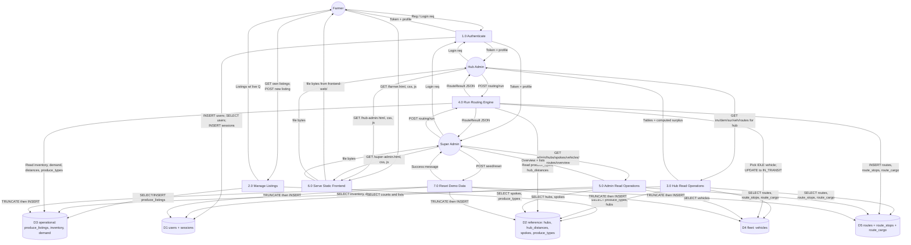
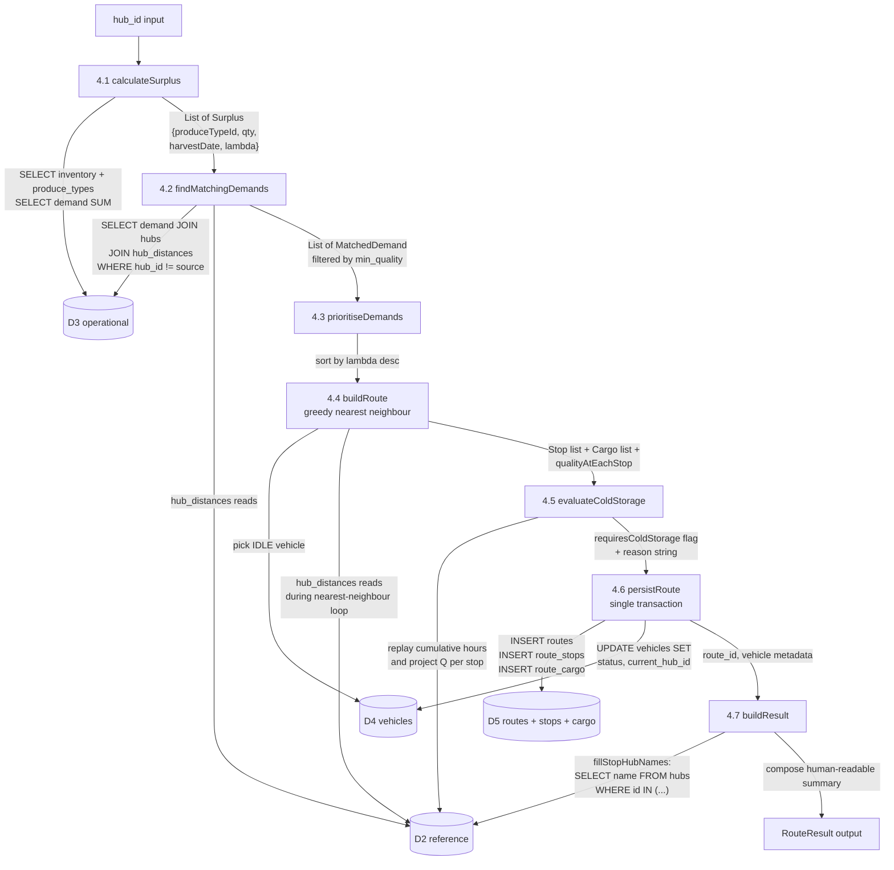
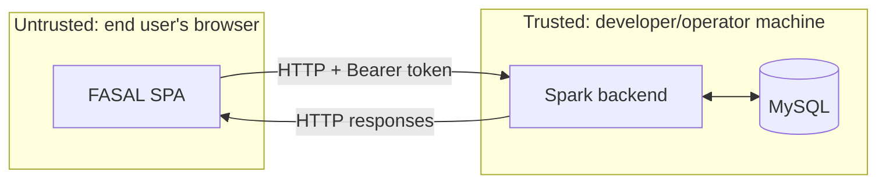

# Data Flow Diagram (DFD) — FASAL

DFDs are presented at three levels, following Yourdon/DeMarco conventions:

* **Level 0** — Context diagram: the whole system as one bubble, with external entities and data flows in/out.
* **Level 1** — Major processes inside the system, plus data stores.
* **Level 2** — Decomposition of the routing engine into its 7 sub-processes.

Mermaid's `flowchart` notation is used. Shape conventions:

| Shape | Mermaid | Meaning |
|---|---|---|
| Rectangle | `[Process]` | A process |
| Stadium | `([External entity])` | An external actor |
| Cylinder | `[(Data Store)]` | A persistent data store |
| Arrow with label | `-->|...|` | A labelled data flow |

---

## 1. Level 0 — Context Diagram

The entire FASAL system is treated as one black box. External entities are the three user personas plus the routing engine's "trigger" (effectively, a Hub Admin or Super Admin pressing a button).

---

## 2. Level 1 — Major Processes Inside FASAL

This unpacks the FASAL bubble into 7 numbered processes and the 5 persistent data stores. Same external entities as before.

### Process Catalogue

| # | Process | Inputs | Outputs | Reads | Writes |
|---|---|---|---|---|---|
| 1.0 | Authenticate | phone, password, [name, role, spoke/hub] | token, profile | D1, D2 | D1 |
| 2.0 | Manage Listings | listing payload / GET request | listings with Q | D2, D3 | D3 |
| 3.0 | Hub Read Operations | hub_id | tables for that hub | D2, D3, D4, D5 | — |
| 4.0 | Run Routing Engine | hub_id | RouteResult | D2, D3, D4 | D4, D5 |
| 5.0 | Admin Read Operations | — | system-wide lists + stats | D1, D2, D4, D5 | — |
| 6.0 | Serve Static Frontend | URL path | HTML/CSS/JS bytes | filesystem | — |
| 7.0 | Reset Demo Data | — | success message | — | D1..D5 |

---

## 3. Level 2 — Decomposition of 4.0 "Run Routing Engine"

The most complex process by far is the routing engine. Expanded here into its 7 sub-processes matching the code structure (`RoutingEngine.runRouting()`).

### 7 Sub-process Definitions

| # | Sub-process | Pure / IO | DB tables involved |
|---|---|---|---|
| 4.1 | `calculateSurplus` | IO | reads inventory, demand, produce_types |
| 4.2 | `findMatchingDemands` | IO | reads demand, produce_types, hubs, hub_distances |
| 4.3 | `prioritiseDemands` | Pure | none |
| 4.4 | `buildRoute` | IO | reads vehicles (pickIdleVehicle), hub_distances |
| 4.5 | `evaluateColdStorage` | IO | reads hub_distances |
| 4.6 | `persistRoute` | IO | writes routes, route_stops, route_cargo; updates vehicles |
| 4.7 | `buildResult` | IO | reads hubs for join-back of names |

### Transactional Boundaries

Sub-process 4.6 is the only one that **writes** to the database. It wraps all three INSERTs and the one UPDATE in `conn.setAutoCommit(false); ... conn.commit();`. If any insert or update fails, the whole route insertion is rolled back. (Currently there is no explicit `rollback()` in the catch block — an exception simply prevents `commit()` from running, and the JDBC connection's auto-close discards the uncommitted transaction.)

---

## 4. Data Dictionary (Selected Flows)

| Flow | Shape (JSON) | Origin process | Destination process |
|---|---|---|---|
| Login req | `{ phone, password }` | Browser | 1.0 |
| Login resp | `{ token, user_id, role, hub_id, spoke_id, name }` | 1.0 | Browser |
| Listing create req | `{ produce_type_id, quantity_kg, harvest_date }` | Browser | 2.0 |
| Listing read resp | `[ { id, farmerId, produceTypeId, quantityKg, harvestDate, hubId, status, createdAt, produceName, lambdaValue, currentQuality } ]` | 2.0 | Browser |
| Hub inventory resp | `[ Inventory ]` with `currentQuality` computed in Java | 3.0 | Browser |
| Hub surplus resp | `[ { produce_type_id, produce_type, inventory_qty, demand_qty, surplus_qty } ]` (snake_case keys) | 3.0 | Browser |
| Routing req | `{ hub_id }` | Browser | 4.0 |
| Routing resp | `RouteResult` JSON — see PROJECT_CONTEXT.md §8.3 | 4.0 | Browser |
| Admin overview resp | `{ total_listings, active_routes, idle_vehicles, hubs_count, total_users, total_vehicles }` | 5.0 | Browser |
| Static asset resp | HTML / CSS / JS / image bytes | 6.0 | Browser |
| Seed reset resp | `{ message: "Database reset and reseeded successfully" }` | 7.0 | Browser |

---

## 5. Trust Boundary

The diagrams above show only one trust boundary: between the browser and the backend. Everything inside the backend is in one JVM process with the same trust level. The JDBC link to MySQL is also inside the trust boundary (loopback on `localhost:3306`).

Implications:

* All input from the browser must be treated as hostile → use `PreparedStatement` everywhere (already done).
* Tokens stored in `localStorage` are vulnerable to XSS → every HTML insertion goes through `esc()` (already done).
* CORS is `*` for the demo — acceptable inside this trust boundary; tighten for production.
