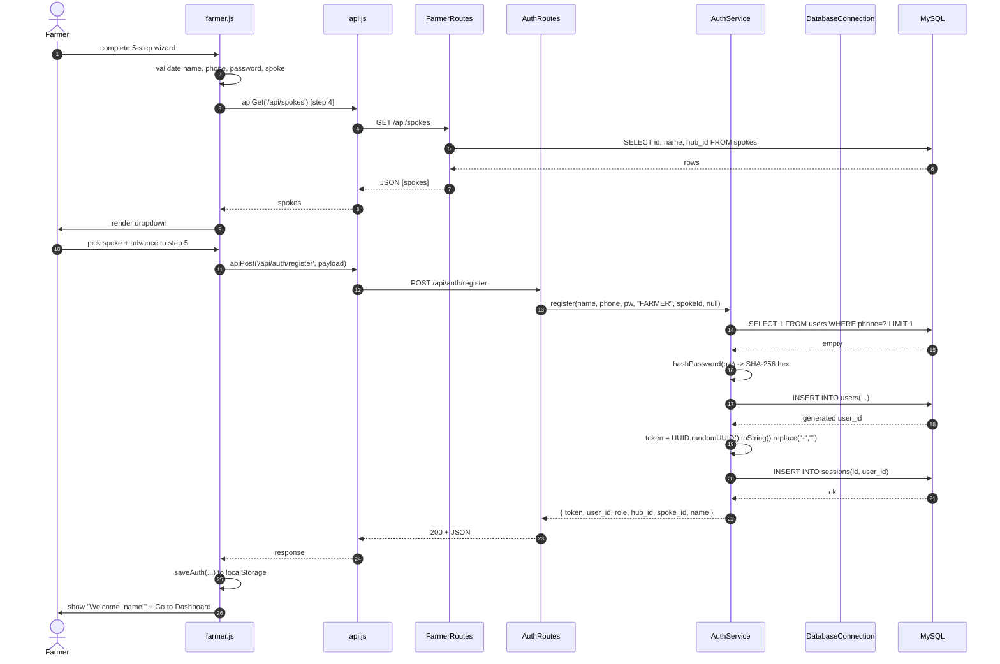
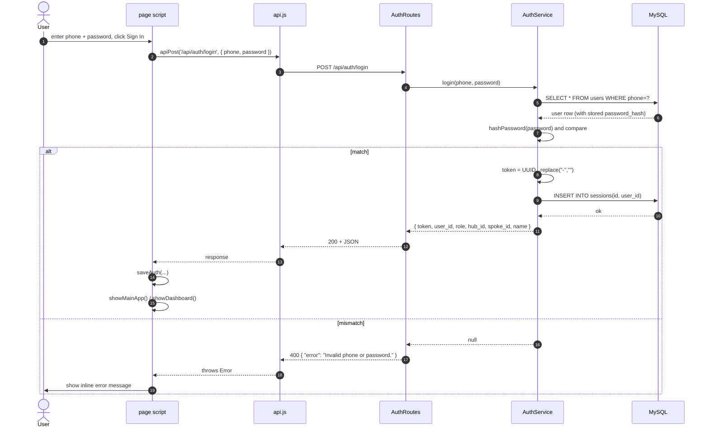
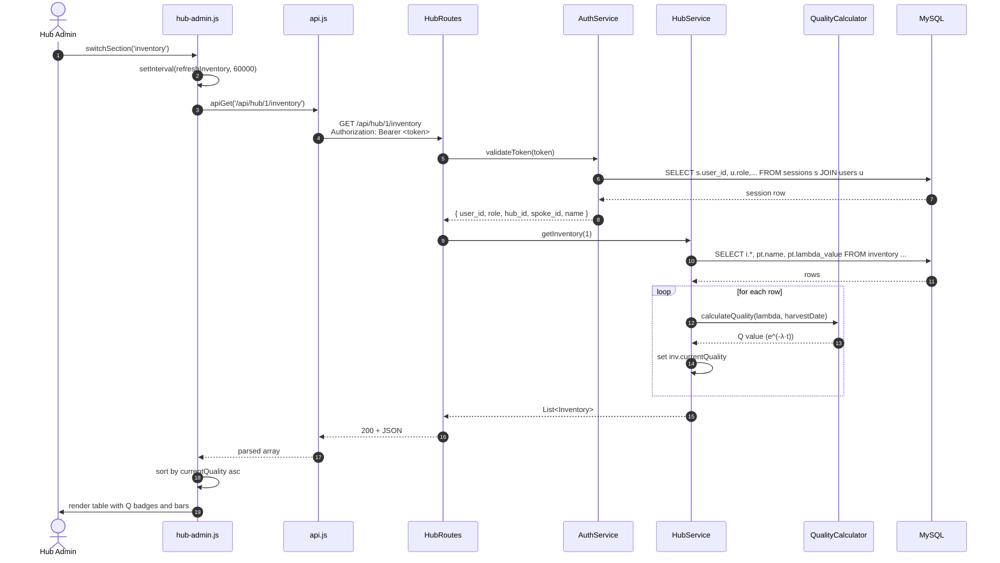
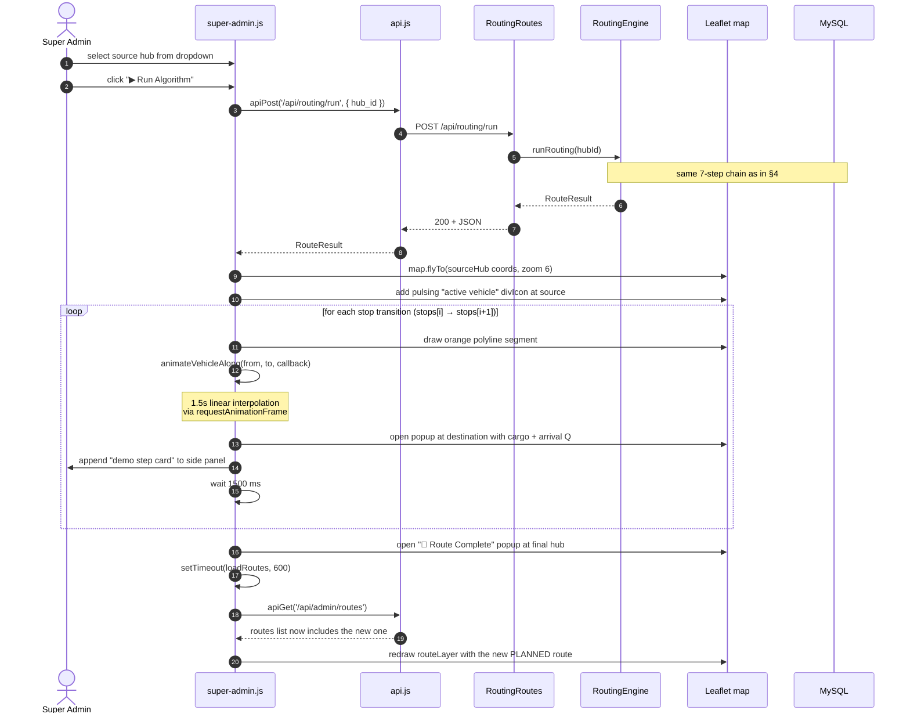
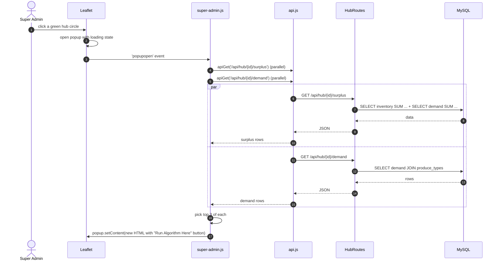
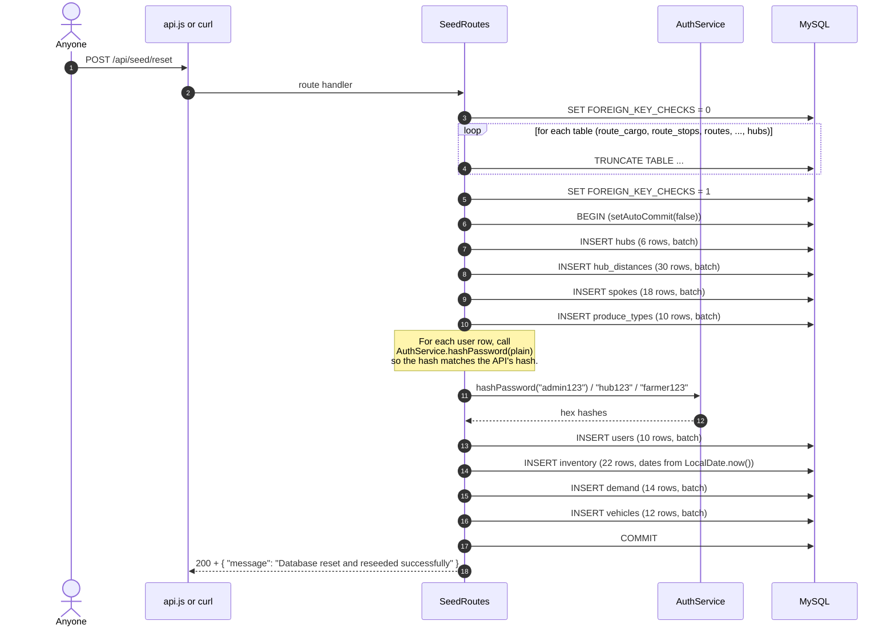

# Sequence Diagrams — FASAL

End-to-end call sequences for every meaningful interaction in the system. Each diagram shows the chain from Browser → Spark routes → Service → Algorithm → JDBC → MySQL.

---

## 1. Farmer Registration



---

## 2. Login (any role)



---

## 3. Authenticated GET — Hub Inventory



---

## 4. Run Routing Algorithm — Full Chain (the headline diagram)

```mermaid
sequenceDiagram
    autonumber
    actor H as Hub Admin
    participant UI as hub-admin.js
    participant API as api.js
    participant RR as RoutingRoutes
    participant AS as AuthService
    participant RE as RoutingEngine
    participant QC as QualityCalculator
    participant DB as MySQL

    H->>UI: click "Run Algorithm Now"
    UI->>API: pre-fetch /api/farmer/produce-types (cached)
    UI->>API: pre-fetch /api/admin/hubs (cached)
    UI->>API: apiGet('/api/hub/1/surplus') [pre-run snapshot]
    UI->>API: apiPost('/api/routing/run', { hub_id: 1 })
    API->>RR: POST /api/routing/run
    RR->>AS: validateToken(token)
    AS-->>RR: session info
    RR->>RE: new RoutingEngine().runRouting(1)

    Note over RE: Step 1: calculateSurplus
    RE->>DB: SELECT inventory + produce_types WHERE hub_id=1
    DB-->>RE: stock per type
    RE->>DB: SELECT demand WHERE hub_id=1 GROUP BY produce_type_id
    DB-->>RE: local demand totals
    RE->>RE: compute leftover = stock - local; keep positives

    Note over RE: Step 2: findMatchingDemands
    RE->>DB: SELECT demand JOIN hubs JOIN hub_distances WHERE hub_id<>1
    DB-->>RE: candidate matches
    loop for each match
        RE->>QC: calculateQualityAtArrival(lambda, harvest, travel_hours)
        QC-->>RE: projected_Q
        RE->>RE: keep if projected_Q >= min_quality_threshold
    end

    Note over RE: Step 3: prioritiseDemands
    RE->>RE: sort matched by lambdaValue DESC

    Note over RE: Step 4: buildRoute
    RE->>DB: SELECT vehicles WHERE current_hub_id=1 AND status='IDLE' LIMIT 1
    DB-->>RE: vehicle (or none)
    RE->>RE: outStops = [ {hub: source, order: 1} ]
    loop nearest-neighbour while pending and capacity>0
        RE->>DB: SELECT travel_time_hours FROM hub_distances
        DB-->>RE: hours
        RE->>RE: pick nearest pending demand
        RE->>RE: assignedKg = min(demand_qty, remainingSurplus, remainingCapacity)
        RE->>QC: calculateQualityAtArrival(lambda, harvest, cumulativeHours)
        QC-->>RE: arrival Q for this stop
        RE->>RE: append RouteStop + RouteCargo
        RE->>RE: deduct capacity, advance currentHub
    end

    Note over RE: Step 5: evaluateColdStorage
    loop for each cargo item
        RE->>QC: calculateQualityAtArrival at its stop's cumulative hours
        QC-->>RE: q
        RE->>RE: if q < demand.min_quality_threshold: coldNeeded=true; append reason
    end

    Note over RE: Step 6: persistRoute (single transaction)
    RE->>DB: BEGIN
    RE->>DB: INSERT INTO routes(vehicle_id, status='PLANNED', requires_cold_storage)
    DB-->>RE: route_id
    RE->>DB: INSERT INTO route_stops batched
    RE->>DB: INSERT INTO route_cargo batched
    RE->>DB: UPDATE vehicles SET status='IN_TRANSIT', current_hub_id=lastStop
    RE->>DB: COMMIT

    Note over RE: Step 7: buildResult
    RE->>DB: SELECT id, name FROM hubs WHERE id IN (...)
    DB-->>RE: hub names for stops
    RE->>RE: compose humanReadableSummary string
    RE-->>RR: RouteResult
    RR-->>API: 200 + JSON
    API-->>UI: RouteResult

    UI->>UI: animateResult(result, surplusSnapshot)
    loop for cardIdx in 0..5 with 400ms stagger
        UI->>H: reveal card N
    end
    Note over UI,H: Cards: Surplus Found, Demands Matched,<br/>Priority Order, Route Planned,<br/>Cold Storage Check, Route Saved
```

---

## 5. Step-Through Algorithm Demo on the Map (Super Admin)



---

## 6. Hub Map Popup — Lazy Load



---

## 7. Frontend Static-File Fetch (post-fix)

```mermaid
sequenceDiagram
    autonumber
    actor U as User
    participant B as Browser
    participant M as Main.java<br/>get("/*") catch-all
    participant FS as Disk (frontend-web/)

    U->>B: navigate to http://localhost:4567/farmer.html
    B->>M: GET /farmer.html
    M->>M: path != /api/* → ok
    M->>M: resolve to frontendRoot + "/farmer.html"
    M->>M: getCanonicalPath check (no traversal)
    M->>FS: read farmer.html
    FS-->>M: bytes
    M->>M: setType('text/html; charset=UTF-8')
    M-->>B: 200 + body stream
    B->>U: render page
    B->>M: GET /css/base.css
    M-->>B: 200 + text/css
    B->>M: GET /js/api.js
    M-->>B: 200 + application/javascript
    B->>M: GET /js/farmer.js
    M-->>B: 200 + application/javascript
```

---

## 8. POST `/api/seed/reset`



Note: `/api/seed/reset` truncates the `sessions` table too — every previously-issued token becomes invalid. Clients should `localStorage.clear()` and log in again after a reset.
