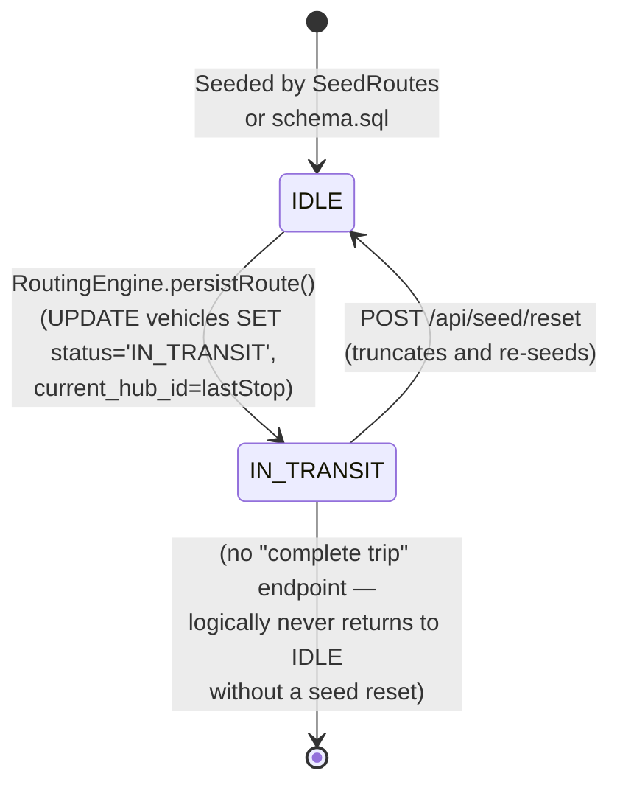
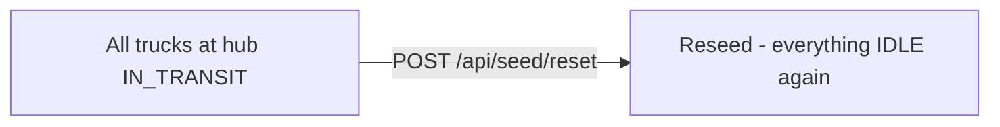
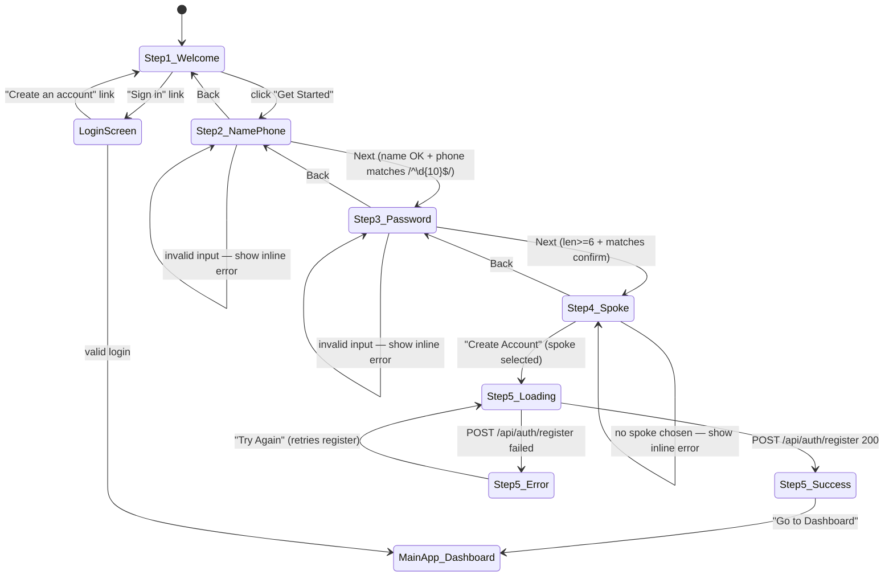
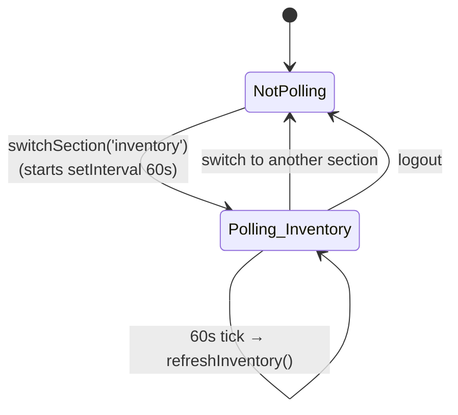
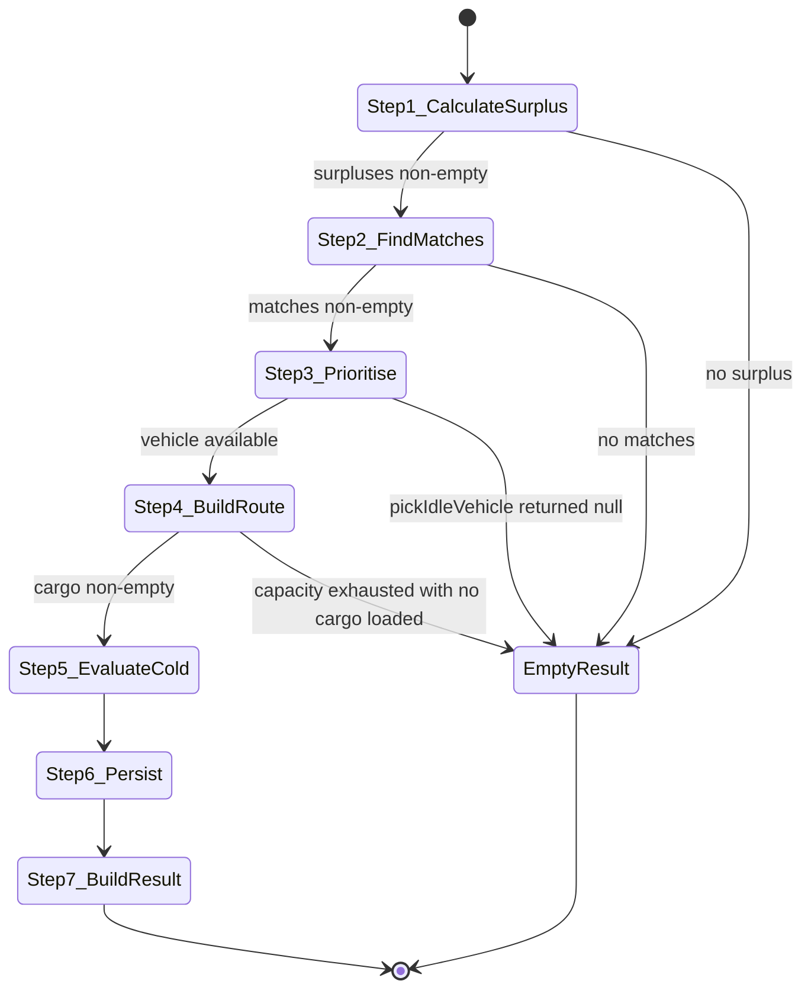

# State Diagrams — FASAL

Three entities in FASAL have meaningful lifecycle state machines:

1. **Vehicle** — `IDLE` ↔ `IN_TRANSIT`
2. **Route** — `PLANNED` → `ACTIVE` → `COMPLETED`
3. **Produce Listing** — `PENDING` → `IN_TRANSIT` → `DELIVERED`

Plus two cross-cutting "logical" state machines worth documenting:

4. **User Session** — the lifecycle of a Bearer token
5. **Onboarding Wizard** — the farmer registration UI state

---

## 1. Vehicle State Machine

A vehicle is created `IDLE` at a hub. When the routing engine picks it up for a route, it flips to `IN_TRANSIT` and its `current_hub_id` is updated to the **last stop** of that route. In the current build there is no "completion" endpoint — vehicles stay `IN_TRANSIT` until manually reset.



### Implementation Notes

* Transition `IDLE → IN_TRANSIT` happens in `RoutingEngine.persistRoute()` as part of the same transaction that inserts `routes` / `route_stops` / `route_cargo`.
* No transition exists for `IN_TRANSIT → IDLE` — once dispatched, the truck stays "on the road" forever in the demo. This is documented as a known limitation in `PROJECT_CONTEXT.md §22` (Future Work).
* If the user calls `runRouting()` again at the same hub after all trucks are `IN_TRANSIT`, the engine returns a `RouteResult` with `routeId = 0` and `humanReadableSummary = "No idle vehicle is currently available at this hub."`.

### Recovery from "All trucks IN_TRANSIT"



---

## 2. Route State Machine

The schema permits `PLANNED`, `ACTIVE`, `COMPLETED`. The current code only ever writes `PLANNED`. `ACTIVE` is a styling hint in the Super Admin map (solid blue) — it would be entered if a future "start trip" endpoint were added. `COMPLETED` is purely defensive — it's filtered out of the renderable routes.

```mermaid
stateDiagram-v2
    [*] --> PLANNED : RoutingEngine.persistRoute()<br/>INSERT INTO routes(...status='PLANNED')
    PLANNED --> ACTIVE : (no transition implemented;<br/>reserved for future "start trip")
    ACTIVE --> COMPLETED : (no transition implemented;<br/>reserved for future "trip done")
    PLANNED --> [*] : POST /api/seed/reset<br/>(TRUNCATE routes)
    ACTIVE --> [*] : POST /api/seed/reset
    COMPLETED --> [*] : POST /api/seed/reset
```

### Where Each State Is Visible

| State | Where it appears |
|---|---|
| PLANNED | The only state actually produced by the code today. Rendered as **dashed orange** polylines on the Super Admin map. Hub Admin "View Route" expander lists these for in-transit vehicles. |
| ACTIVE | Would be rendered as **solid blue** polylines on the Super Admin map. Code path exists; no UI/API to trigger the transition. |
| COMPLETED | Routes layer renderers explicitly skip these (`if (route.status === 'COMPLETED') return;`). |

### Useful SQL to Inspect

```sql
SELECT status, COUNT(*) FROM routes GROUP BY status;
```

---

## 3. Produce Listing State Machine

Produce listings start `PENDING`. The schema allows `IN_TRANSIT` and `DELIVERED`, but the current code never moves them — they stay PENDING. The state field is defensive infrastructure for a future "pack listings onto a route" workflow.

```mermaid
stateDiagram-v2
    [*] --> PENDING : FarmerService.createListing()<br/>INSERT INTO produce_listings(...status='PENDING')
    PENDING --> IN_TRANSIT : (no transition implemented;<br/>reserved for "pack onto route")
    IN_TRANSIT --> DELIVERED : (no transition implemented;<br/>reserved for "arrived")
    PENDING --> [*] : POST /api/seed/reset
    IN_TRANSIT --> [*] : POST /api/seed/reset
    DELIVERED --> [*] : POST /api/seed/reset
```

### Visual Hint in the UI

The farmer dashboard already renders the status with a colour-coded badge — `PENDING` is grey, `IN_TRANSIT` is yellow, `DELIVERED` is green — so when these transitions are implemented later, the UI will Just Work.

---

## 4. User Session State Machine

A Bearer token is a lightweight state machine: it doesn't exist, then it exists, then it's removed.

```mermaid
stateDiagram-v2
    [*] --> AnonymousVisitor : Browser opens any FASAL page
    AnonymousVisitor --> Authenticated : POST /api/auth/login or /register OK<br/>(INSERT into sessions; localStorage.fasal_auth set)
    Authenticated --> Authenticated : every authenticated fetch<br/>(token lives forever)
    Authenticated --> AnonymousVisitor : user clicks logout<br/>(localStorage.removeItem; reload)
    Authenticated --> StaleToken : POST /api/seed/reset OR<br/>schema rebuild wipes sessions
    StaleToken --> AnonymousVisitor : manual localStorage.clear()<br/>(or proposed auto-clear on 401)
    AnonymousVisitor --> [*]
```



### Pain Point: StaleToken State

The `StaleToken` state is the bug documented in `GITHUB_ISSUES.md` Issue #3 — the token is present in `localStorage` but the server doesn't recognise it. The frontend's `isLoggedIn()` returns `true` based on `localStorage` alone, so the app routes to the dashboard, every fetch then returns `401`, and the user is stuck.

Proposed fix to make StaleToken → AnonymousVisitor automatic:

```javascript
// in api.js
if (!response.ok) {
  if (response.status === 401) clearAuth();   // auto-recover
  throw ...
}
```

---

## 5. Farmer Onboarding Wizard

The frontend's 5-step wizard is itself a state machine. `farmer.js` keeps the progression in module-level state (`onboardingState`) plus the visible step.



### State Persistence

* The wizard's state (name, phone, password, spokeId) is held in the JS object `onboardingState`, not in the URL or localStorage. A page refresh in the middle of the wizard restarts it from Step 1.
* The progress bar fill width is `(stepNumber / 5) * 100%`.
* Numbered step indicators take the `active` class for the current step and the `done` class for previously-completed steps.

---

## 6. Hub Admin Dashboard — Polling State



The same pattern applies to the farmer Home tab, except the interval is 30 seconds (`DASHBOARD_REFRESH_MS`).

---

## 7. Routing Engine — Per-Call State

Within a single `runRouting(hubId)` invocation the engine moves through these internal "states" (steps), each of which can short-circuit to a terminal "Empty Result" state:



Each `EmptyResult` produces a `RouteResult` with `routeId = 0`, `requiresColdStorage = false`, and a `humanReadableSummary` explaining why nothing happened — surfaced to the UI as a single information card instead of the usual 6 step cards.

---

## 8. Combined Lifecycle: Vehicle + Route + Listing

A real-world view of what state each entity is in after one successful `runRouting` call:

| Before run | After run |
|---|---|
| Vehicle: IDLE | Vehicle: IN_TRANSIT |
| Vehicle.current_hub_id: source_hub_id | Vehicle.current_hub_id: last_stop_hub_id |
| Route: (does not exist) | Route: PLANNED |
| route_stops: (does not exist) | route_stops: N rows (source + N-1 destinations) |
| route_cargo: (does not exist) | route_cargo: 1..N rows |
| Produce listings: PENDING | Produce listings: PENDING (unchanged — listing status is decoupled from routing in this build) |
| inventory rows | inventory rows (unchanged — surplus is computed, not deducted from inventory) |

⚠️ Note: the routing engine **does not** decrement `inventory.quantity_kg` after dispatch. This means a subsequent `runRouting` call against the same hub will see the same surplus and may try to dispatch the same goods again to a freshly-idle vehicle (if `seed/reset` were called). In production this would need a "consume from inventory on dispatch" step.
