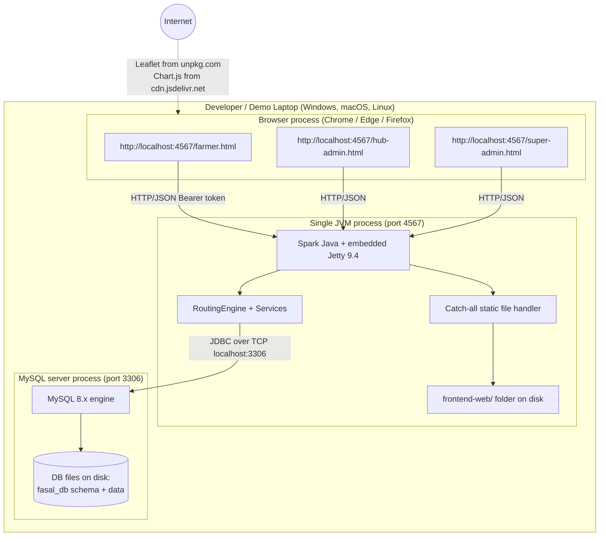
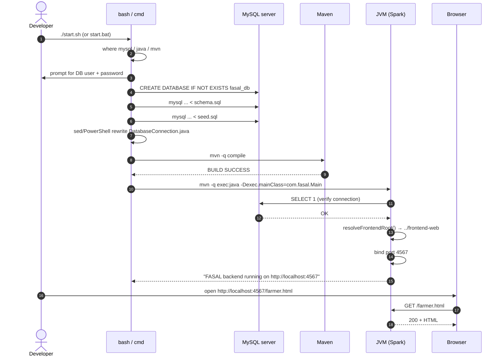
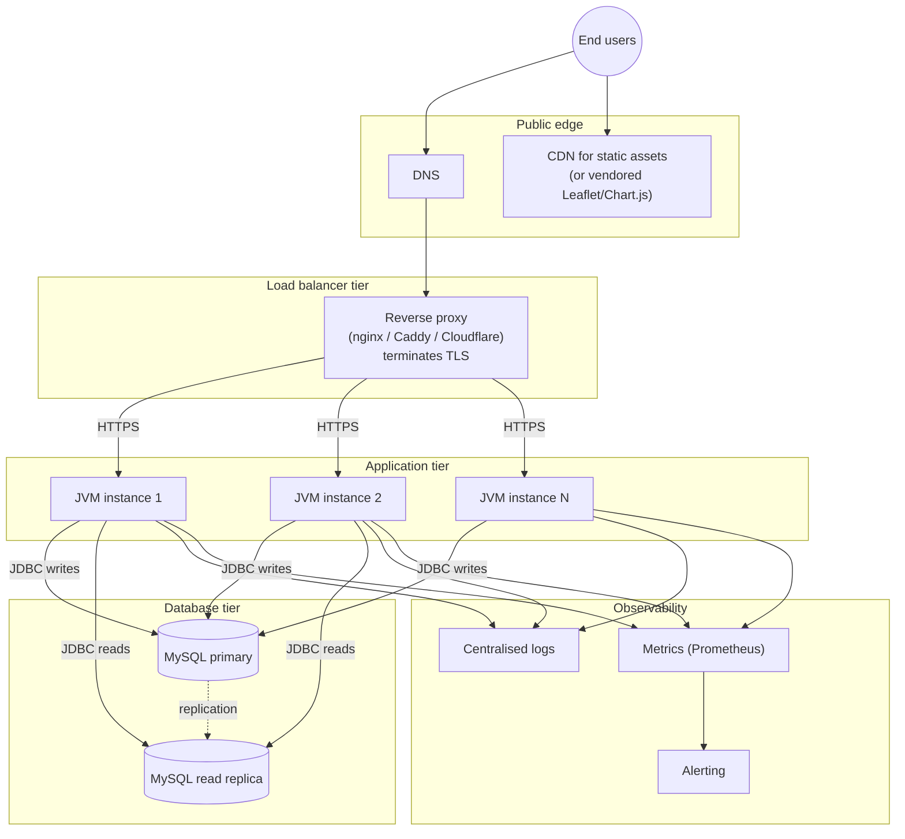

# Deployment Diagram — FASAL

Two views: the **as-built local-development deployment** (which is what FASAL is designed for), and a **notional production deployment** showing how it could be hardened for real use.

---

## 1. As-Built — Local Development Deployment

This is what the README, `start.sh`, and `start.bat` produce:



### Key Facts

| Facet | Value |
|---|---|
| OS support | Windows, macOS, Linux |
| Processes | 2 (JVM + MySQL) |
| Ports | 4567 (HTTP), 3306 (MySQL) |
| Threads | Spark/Jetty thread pool (default 200 max) |
| Persistent storage | MySQL's data directory only |
| External dependencies (runtime) | Two CDNs for Leaflet & Chart.js |
| Memory footprint | ~200 MB JVM + MySQL's own |
| Cold start | ~5 s for `mvn exec:java` |
| Setup tools required | Java 11+, Maven 3.6+, MySQL 8.0+ |

### Bring-Up Sequence



### Files Touched During Bring-Up

| File | Read/Write | When |
|---|---|---|
| `database/schema.sql` | read | once, by `mysql` client |
| `database/seed.sql` | read | once |
| `backend/src/main/java/com/fasal/db/DatabaseConnection.java` | **write** (in-place sed/PowerShell substitution) | once per `start.*` invocation |
| `backend/target/**` | write | by Maven `compile` |
| `frontend-web/**` | read | continuously by static file handler |
| MySQL data directory | write | continuously by MySQL |

---

## 2. Notional Production Deployment

What FASAL **would look like** if hardened for real-world operation. Not implemented today — provided for completeness.



### Required Changes from "As-Built" → "Production"

| Area | Today | Production |
|---|---|---|
| Transport | HTTP only | HTTPS terminated at reverse proxy |
| Auth | SHA-256, never-expiring tokens | bcrypt/argon2; expiring access + refresh tokens; rotate on use |
| Authorisation | Token presence check only | Per-route role checks server-side |
| CORS | `*` | Strict allow-list of approved origins |
| DB credentials | Rewritten into Java source by `start.sh` | Read from env vars / vault / secret manager at runtime |
| DB connection management | New connection per request | Connection pool (HikariCP) |
| Logging | `System.out.println` | Structured JSON via SLF4J + Logback to file/stdout collected by Promtail/Fluent Bit |
| Metrics | None | Micrometer → Prometheus |
| Process supervision | manually `./start.sh` | systemd / Docker / Kubernetes; readiness/liveness probes |
| Schema migrations | Truncate + reload (`/api/seed/reset`) | Flyway or Liquibase versioned migrations |
| Static assets | served by Spark | served by CDN or reverse proxy |
| Frontend libraries | Loaded from CDN | Vendored OR served from same origin |
| Scaling | Single JVM | Horizontal app tier behind LB; sticky sessions unnecessary (stateless except tokens in DB) |
| DB | Single MySQL instance | Primary + read replicas; nightly backups; PITR |

### Statelessness Note

The Spark backend is **already stateless** between requests — every call goes through JDBC to MySQL; nothing is cached in JVM memory across calls (except the resolved `frontendRoot`, which is the same on every instance). This means horizontal scaling requires no sticky sessions; any instance can answer any request.

---

## 3. Component & Port Map

A compact table of "what listens where":

| Component | Process | Host | Port | Protocol | Notes |
|---|---|---|---|---|---|
| Spark backend | `java -jar fasal-backend.jar` or `mvn exec:java` | localhost | **4567** | HTTP/1.1 | Default; change `SERVER_PORT` in `Main.java` to relocate |
| MySQL | `mysqld` | localhost | 3306 | MySQL wire protocol | Default; change in `DatabaseConnection.DB_URL` |
| Browser → Spark | Browser tab | localhost | 4567 | HTTP | Bearer-token authenticated |
| JVM → MySQL | JDBC inside the JVM | localhost | 3306 | TCP via mysql-connector-j | `useSSL=false` for local demo |
| Browser → CDNs | Browser tab | `unpkg.com`, `cdn.jsdelivr.net` | 443 | HTTPS | Only the Super Admin page depends on this |

---

## 4. Failure Modes & Recovery (As-Built)

| Failure | Symptom | Recovery |
|---|---|---|
| MySQL down | `Main.verifyDatabaseOrExit()` prints "FATAL: Could not connect to MySQL." and exits with code 1 before listening on 4567 | Start MySQL service, re-run `./start.sh` |
| Wrong DB credentials | Same as above with error message including JDBC details | Edit `DatabaseConnection.java` or re-run `./start.sh` and answer the prompts |
| Port 4567 in use | Spark/Jetty throws bind exception on startup | `lsof -i :4567` (mac/linux) or `netstat -ano | findstr :4567` (Windows), kill the offender; or change `SERVER_PORT` |
| All trucks IN_TRANSIT | `runRouting()` returns `routeId=0` with reason "No idle vehicle is currently available at this hub." | `curl -X POST http://localhost:4567/api/seed/reset` |
| Stale `localStorage` token | UI seems logged in but every fetch returns 401 toasts | DevTools console → `localStorage.clear(); location.reload();` |
| Internet down (Super Admin map) | Map tiles and Chart.js may fail to load | Use Farmer / Hub Admin pages which don't depend on CDNs |
| Disk full | MySQL refuses writes; Spark logs errors | Free disk; restart |

---

## 5. Disk Layout at Runtime

```
~/project/FASAL/                           ← project root (working directory)
├── backend/
│   ├── pom.xml
│   ├── target/
│   │   ├── classes/                       ← compiled by `mvn compile`
│   │   ├── dependency-reduced-pom.xml     ← (only when shading is used)
│   │   └── fasal-backend.jar              ← (only after `mvn package`)
│   └── src/...
├── frontend-web/                          ← served by Spark's catch-all GET
└── database/
    ├── schema.sql
    └── seed.sql

<MySQL data dir, e.g. /var/lib/mysql or C:\ProgramData\MySQL\MySQL Server 8.0\Data>
└── fasal_db/
    ├── hubs.ibd
    ├── inventory.ibd
    ├── ...
    └── (13 InnoDB tablespace files)
```

The JVM's "working directory" when started via `./start.sh` is `~/project/FASAL/backend/` (because `start.sh` does `cd backend` before `mvn exec:java`). `Main.resolveFrontendRoot()` therefore finds `../frontend-web` as its first match.

---

## 6. Resource Budgets (Observed on a Dev Laptop)

| Resource | Idle | Under demo load |
|---|---|---|
| JVM heap | ~80 MB | ~120 MB |
| MySQL RSS | ~250 MB | ~250 MB |
| CPU (4-core laptop) | < 1% | < 5% on a `runRouting` call |
| Disk (DB files) | < 1 MB | < 10 MB |
| Network | None (local) | None |

FASAL is intentionally light — appropriate for a demo on a typical 8 GB development laptop.
